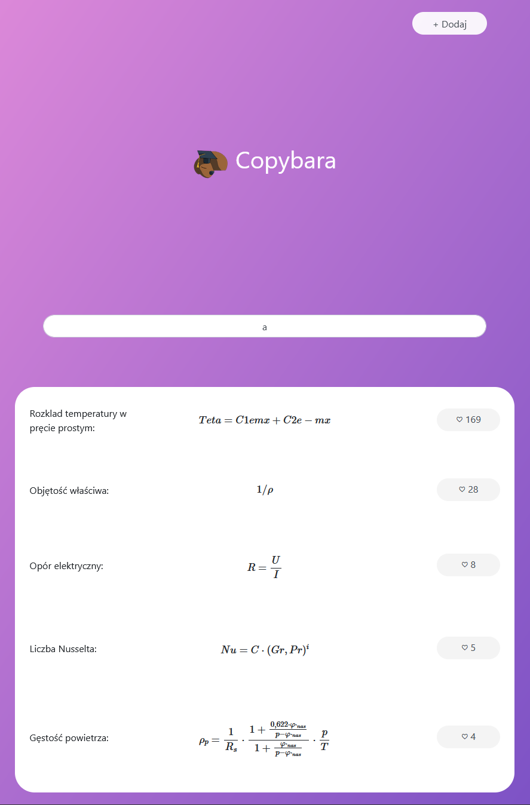
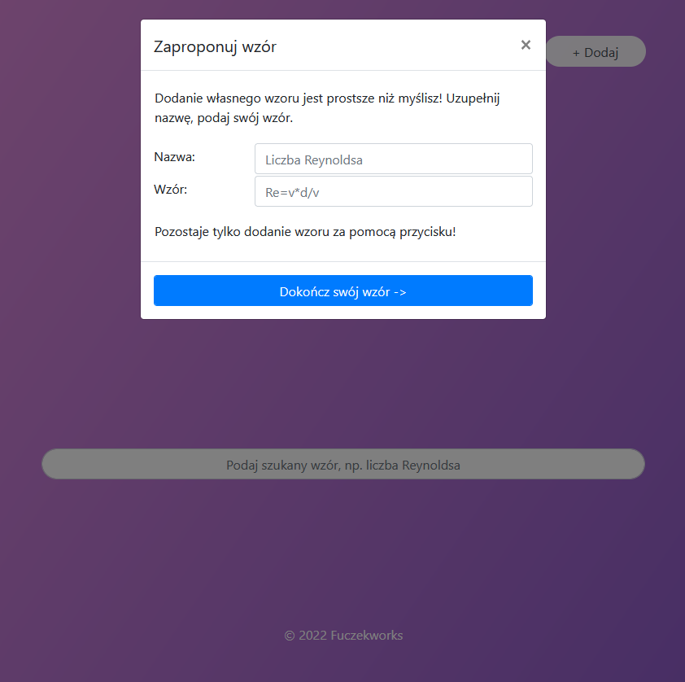

# Kapibara - Community driven wiki of University equations

Work in progress. This project is meant to be a community-driven wiki for referencing specific equations for Wroclaw University of Science and Technology. It allows for the upload of your own equations via LaTeX syntax, which is later translated with MathJax. This can be later copied to your Word file as a MathML code or into LaTeX format.
It features a PostgreSQL database divided by faculties and subjects, which also stores like amounts. The site pushes the good results up front.

The front-end is made with Bootstrap 5 with AJAX calls, and uses Flask for backend.

Main page allows searching for equations:

The dynamic search updates with each keystroke:

Later you can add an equation yourself (wip):

